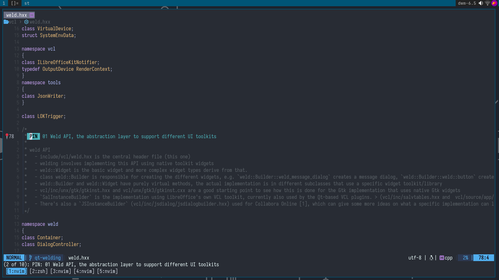
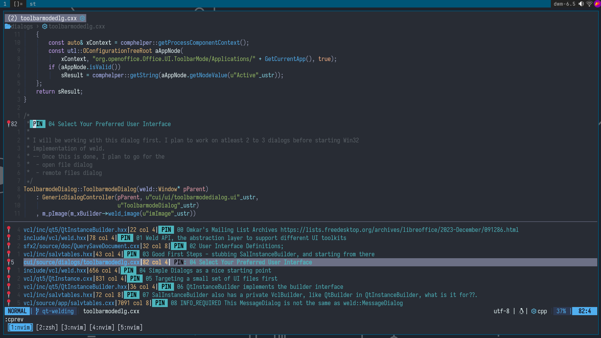

<!--toc:start-->
- [Developer Handbook](#developer-handbook)
  - [OOP is Bad](#oop-is-bad)
  - [Programs Should be Written in Interations](#programs-should-be-written-in-interations)
  - [Know the Variables](#know-the-variables)
  - [Have Well Defined Milestones](#have-well-defined-milestones)
  - [Working on Big Problems](#working-on-big-problems)
    - [How I Save My Thoughts](#how-i-save-my-thoughts)
  - [Before Pusing a Patch](#before-pusing-a-patch)
  - [Tracking Daily Progress](#tracking-daily-progress)
  - [One Liners](#one-liners)
<!--toc:end-->

# Developer Handbook

## OOP is Bad

I learnt C in my  first year, then moved to C++ (last 1.5  years). I now feel that
OOP  (or any  programming paradime  for that  matter) is  harmful for  newbies. It
conditions the brain to  think of problems in a certain way,  which has nothing to
do with  the problem.  We try to  then fit our  program/problem into  the paradime
which is highly limiting both expressiveness and performance wise.

The code should evolve into a paradime  of it's own as the problem demands. That's
why I have decided to exclusively use C and Lua for my personal projects.

## Programs Should be Written in Interations

Often there are projects where some part of the code is for creating the structure
(the UI)  and the other part  of the code is  for implementing the logic  for that
structure. It's  often tempting to  stub the parts of  the structure and  build it
fully first, and then implement the background logic.

I don't think it's a good approach. Rather taking small but complete steps is more
productive as  then we  (with each  step) mark tasks  as completed.  This approach
doesn't fail. On the other hand,  building the whole structure beforehand leads to
confusion as then we would  have to keep it in our head all  the time. And most of
the time we aren't able to cross any  item on our todo list which might affect our
motivation in the long run.

## Know the Variables

I worked on a [GSoC  project] in the summer of 2024. It was  a big project where I
implemented themeing  in LibreOffice for  windows, macos and linux{gtk,qt}.  I was
working on 4 patches simultaneously often comming  back to a patch after a week or
two. 

When I came back  to the kde/qt patches after working on the  others, I found that
the menubar stopped responding to the colors set using the theme. I thought it was
some bug introduced by  me.. but it was not! After going back  and forth for quite
some time, I thought of the possibility that the theme was buggy, and I was right.

I  [reported] a  bug  for  the same.  The  moral  of the  story  is  to keep  such
dependencies in check and if possible, switch  to local builds for the duration of
the project.

[GSoC project]: https://summerofcode.withgoogle.com/programs/2024/projects/M5PxrB9V
[reported]: https://bugs.kde.org/show_bug.cgi?id=493550

## Have Well Defined Milestones

Again a  lesson from the  [GSoC project] I talked  about in the  previous heading.
Whenever  working  on  some  project  make   sure  that  you  know  of  the  exact
expectations/milestones. I  wrote a lot of  code handling all kinds  of edge cases
which I could  think of, but in  the end most of  that code was thrown  out of the
window.

I felt  that if I  had everything planned  out, I could have  saved a lot  of time
during the project. But since this was  my first project, and I didn't know what's
possible and what's not possible beforehand, there was no way of avoiding it. 

I think this comes automatically with experience but still something to know about
and not  repeat. Learning about software  planning can be another  way of avoiding
such situations although many experienced/vocal software developers suggest not to
follow such methods, as they are irrelevant to how the software actually works.

[GSoC project]: https://summerofcode.withgoogle.com/programs/2024/projects/M5PxrB9V

## Working on Big Problems

Which problems  are big problems?  Problems which you cannot  fit in your  head at
once, or  those which require  work spanning  over multiple weeks/months  are hard
problems IMHO.  Such problems cannot  be solved by  just intuition, and  require a
methodical approach, a technique. It can be slow but is deterministic.

Always keep the logs  of the what you looked into, what you  found, what that lead
to etc.  This way you don't  run around in circles,  and it's easy to  resume from
where you  left a week or  a month ago. Also  these logs are helpful  when we need
help from someone more experienced. 

Sharing logs  can make it  really easy for the  other person to  quickly reproduce
your work and give some meaningful feedback. Otherwise they will be solving it for
you. 

The other person (a senior dev??) in most  cases doesn't have the code at the back
of their heads, and  therefore has to leave their work, create  a new branch, pull
your changes, and see what might be wrong. When you hit a wall, make sure that you
try a couple of  approaches, check if all the steps were correct,  and only if you
find yourself hitting the same wall you ask others for help. 

On the other hand, please ask others for help at once when you feel you tried your
all. Sometimes  the topic  is complex and  someone who knows  about that  area can
explain it in really simple words. What if there is some better and simpler way of
doing the same thing.

### How I Save My Thoughts

I  tried using  emacs for  taking notes,  that  didn't work  as I  use neovim  for
programming,  and neovim  and emacs  can't live  together on  one system.  I tried
separate notes but it felt wierd. I now  take notes in the code itself, next to it
as comments. This way  I read the comment and I am at  the place which the comment
describes. Now I needed a way of navigating through those comments in order.

Neovim  has  this  cool  plugin [folke/todo-comments.nvim]  which  allows  you  to
navigate through  your comments in a  projects which have a  specific keyword, and
it's very customizable  from the keywords to  the regex for search.  I [forked] this
plugin and modified it to show the comments in a sorted order.

[folke/todo-comments.nvim]: https://github.com/folke/todo-comments.nvim
[forked]: https://github.com/printfdebugging/todo-comments.nvim


So this first comment  is about the weld API. `PIN: 00` is  the starting point for
all comments. Let's say I have a few such  comments, and now I want to go over all
of them in sequence.. I just have to press a keybinding `<leader>a` in my case and
I get a  list of all PIN comments in  sorted order. I can press `C-n`  or `C-p` to
navigate through this list to quickly go over the comments.



Let's say there is some symbol mentioned in the comment, I can go to that symbol's
definition in the codebase  from the comment itself (thanks to  LSP). If the notes
were separate from  the code, I would  have to search for that  symbol... too much
friction. These  comments will remain in  the patches till the  final code review,
and once everything is approved, I will remove these comments and merge the code.

## Before Pusing a Patch

Often big  changes/projects are implemented  in a series  of patches one  of which
might span over weeks and you might  have to juggle between them in that duration.
Over time I  noticed that the patch  started with some commit message,  but by the
end it was very  different from what the initial commit  message described. So now
I  review  the  commit message  with  every  iteration  of  the patch  adding  new
information, and removing the irrelevant bits.

Another common thing that I noticed is  whenever the patch goes through many "big"
changes where  the strucutre/semantics change,  there are often some  changes that
are left lingering behind as they don't show up in the `git diff`. The solution to
this is to do a `git reset --soft  HEAD~1` and unstage all the hunks in the patch,
then work on the patch and when it's done,  review each hunk again to see if it is
required or not.

## Tracking Daily Progress

This I learnt  recently as a part  of my internship at [allotropia].  So every day
before starting the work,  you create a readme file where  you make three sections
`## TODO`, `##  DONE` and `## BLOCKERS` and  start with a list of  `TODO`s for the
day. Then  as you complete some  `TODO`s, you put  them in the `DONE`  section. If
anything is causing some  issue like some problem which you  would like to discuss
with  the  team/more experienced  developers,  you  put  that in  the  `BLOCKERS`s
section.

[allotropia]: https://allotropia.de

Here's my README file for today's tasks

```md
# 2024-11-20

## TODO

* tdf#163620 themes ui 
  + polish the ui (margins etc)
  + continue with writing the logic part (registry entries & code)

* update help pages 
  + in separate patches after the ui is done
  +  01012000.xhp this and related files go away
  + remove old information related to appcolors and personalization tabs
  + add info related to appearance tab

## DONE

* attend the design meeting

* push rebased macos patch for review
  + rebased and pushed the patch from linux
  + filed a bug report on github 
    (https://github.com/quickemu-project/quickemu/issues/1522)

* another attempt to install macos (using OSX-KVM)
  + not worth wasting a single more second
    + installation is quite tidious
    + even then no gaurantee that it will work

## Blockers
```

The best part is  that we have daily standups (meetings) where  we discuss what we
worked on  today, and what we  plan to work on  for the rest of  the day. Thorsten
(the boss)  is not ordering  others around but rather  like myself shares  what he
worked on during the day and what he plans to work on.


## One Liners

- use `cassert()` wherever something is assumed  like the value of a variable, non
  nullness of a pointer etc.

